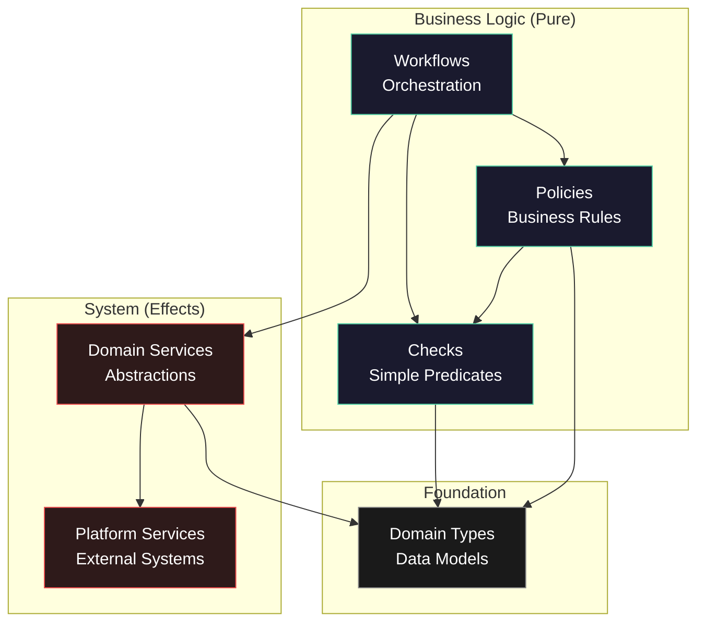

# effect-template
A template repository for LLM-driven development of Effect applications, with comprehensive documentation, rules, and checklists designed for AI consumption.

## What Is This?

This is **not** a traditional application template. Instead, it's a meta-template designed to accelerate LLM-assisted development by providing:

1. **Centralized Rules & Patterns**: A single source of truth for architectural patterns, coding conventions, and best practices for Effect-based TypeScript applications
2. **LLM-Optimized Documentation**: Structured documentation that serves as context for AI assistants to scaffold new projects correctly
3. **Automated Code Review**: Checklists that enable LLMs to self-review their output before human review, catching common issues automatically
4. **Reusable Foundation**: Fork this repository to quickly start new projects with pre-configured architectural guidance

## How to Use

1. **Fork this repository** when starting a new Effect project
2. **Provide relevant documentation** from `docs/` as context to your LLM
3. **Ask the LLM to scaffold** your application following the documented patterns
4. **Use checklists** (in `docs/framework/effect/checklists/`) to have the LLM review its own code
5. **Review the LLM's work** knowing common issues have already been addressed

## Design Overview
### Books
This is a project template that is based on Scott Wlaschin's [*Domain Modeling Made Functional*](https://pragprog.com/titles/swdddf/domain-modeling-made-functional/). It also uses some of the ideas from Eric Normand's [*Grokking Simplicity*](https://www.manning.com/books/grokking-simplicity).

### General Ideas
The project is focused on allowing you to do domain driven design with a pre-planned layout for following the pipeline style that Wlaschin describes in his book. Both Wlaschin and Normand talk about separating your project into several parts. As Normand puts it there are "Data, Calculations, and Actions".

- Data: The actual data, like `5`, `value`, `<object>`
- Calculations: Pure functions that have no side effects
- Actions: Functions that change the world, they take "action", like writing to the database

Wlaschin describes similar things in his book. He talks about the idea of an "onion architecture" - you do data validation and I/O on the outermost layers, and get more functional as you go deeper into the program. At the center are pure pipelines containing your business logic.

### TypeScript's Effect
This project uses `Effect` for its improvement of the standard library, functional features, `ZIO` type system, and relies heavily on the `services`/`layers` components. Because the services and layers provide such an easy way to separate your application into composable pieces the project is laid out in the onion fashion Normand and Wlaschin talk about.

### Architecture Layers



**Layer Descriptions:**

- **Business Logic (Pure Functions)**
  - **Workflows**: Orchestrates checks and policies. Example: `completePurchase` coordinates validation, inventory checks, and payment
  - **Checks**: Small, context-light predicates answering domain questions. Example: `isValidCart()`, `hasRole("admin")`
  - **Policies**: Business decision rules composing checks with context. Example: `canPurchase()` checks inventory, user eligibility, and business hours

- **System (Side Effects)**
  - **Domain Services**: Abstractions over external systems. Example: `PersistenceService.findNodeById()` abstracts database operations
  - **Platform Services**: Actual external system calls. Example: `Neo4jService.query()` makes direct database calls
  
- **Foundation**
  - **Domain Types**: Branded types and models avoiding primitive obsession. Example: `Email`, `Money`, `Cart`

For a detailed source code directory layout, see [docs/project-structure/directory-layout.md](docs/project-structure/directory-layout.md).

## Documentation Structure
There are several levels of rules:
1. Core Rules
2. One Line Examples
3. Detailed Examples

The documentation is organized as follows:

```
docs/
├── core-rules/
│   ├── core.md
│   ├── level-1/
│   └── level-2/
├── framework/
│   └── effect/
│       ├── <topic>/
│       │   ├── level-1/
│       │   └── level-2/
│       └── checklists/
│           └── <split into 20 item chunks>
├── project-structure/
│   ├── overview.md
│   ├── directory-layout.md
│   └── conventions.md
└── template-details/
    ├── rule-examples.md
    └── considerations.md
```

For detailed examples of each rule level, see [docs/template-details/rule-examples.md](docs/template-details/rule-examples.md).
